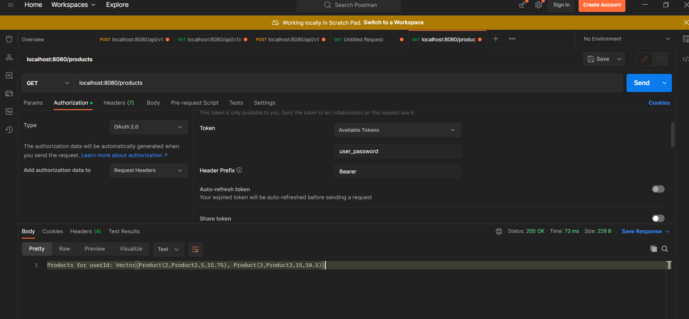

# Scala Web Application with Akka HTTP

This is a Scala web application template using Akka HTTP for building a simple product management system with user authentication and CRUD functionality.

## Table of Contents

- [Features](#features)
- [Prerequisites](#prerequisites)
- [Getting Started](#getting-started)
- [Project Structure](#project-structure)
- [Configuration](#configuration)
- [Database Setup](#database-setup)
- [Run the Application](#run-the-application)
- [Testing](#testing)
- [Contributing](#contributing)
- [License](#license)

## Features

- User authentication with different roles (admin, user)
- Login form with error notification for incorrect parameters
- Product management with CRUD functionality
- Database seeding scripts for users and products
- Unit tests for backend calculations

## Prerequisites

Make sure you have the following installed:

- Scala
- SBT (Scala Build Tool)
- PostgreSQL (for the database)

## Getting Started

1. Clone the repository:

   ```bash
   git clone <repository-url>

2. Launch postgresql on host or on docker
3. Write database connection configurations into application conf in _src/main/resources/application.conf_
4. Execute scripts from _src/main/resources/scripts_ in below order
    -- init.sql
    -- users.sql
    -- products.sql
    -- user_products.sql
5. Launch **src/main/scala/ProductApplication.scala**

## Login and password

1. go to localhost:8080/login after successful launch of the application
2. enter user|user_password to login with user role user
3. enter admin|admin_password to login with admin role user
4. using postman or any other rest client post to the localhost:8080/products
   with Authorization http header, it value should be the same with password of the user (for the sake of simplicity for the interview)
5. Currently, we have two users inserted already, we should be able to retrieve products owned by _user_ or _admin_
6. Do the post request with below authorization params
